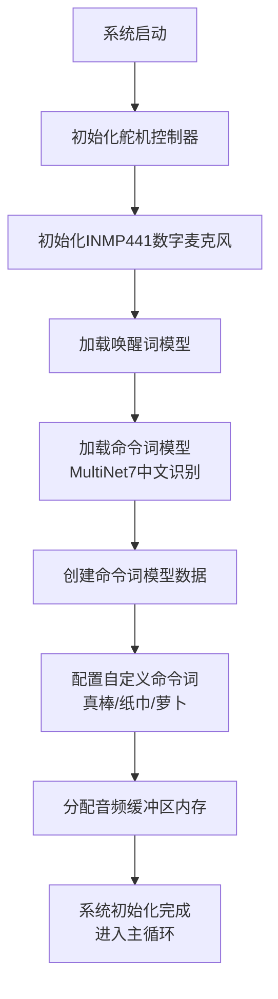
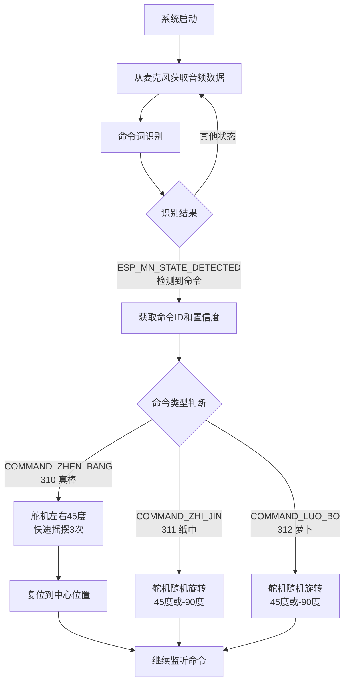

# 🎤 ESP32-S3 智能语音助手 - 舵机控制版

> **智能语音控制舵机** | 支持语音唤醒、命令识别和舵机精确控制

**项目特色**：通过语音命令控制SG90舵机旋转，实现智能化的机械控制

## 🌟 本示例代码主要做了什么？

这是一个完整的智能语音助手实现，专门用于控制SG90舵机。当你说"你好小智"时，它会播放欢迎音频并进入命令模式。然后你可以说"帮我开灯"（舵机顺时针旋转90度）、"帮我关灯"（舵机逆时针旋转90度）等指令，系统会控制舵机旋转并播放确认音频。

**为什么做这个？**
舵机是机器人和自动化项目中的核心组件，通过语音控制舵机可以实现更智能的人机交互。这个项目展示了如何将语音识别技术与精确的PWM舵机控制相结合，为智能机器人、自动化设备等项目提供参考。

## ⚡ 功能特性

- ✅ **语音唤醒检测** - 支持"你好小智"唤醒词
- ✅ **命令词识别** - 支持"帮我开灯"、"帮我关灯"、"拜拜"等指令
- ✅ **SG90舵机控制** - 根据语音指令精确控制舵机角度
- ✅ **PWM精确控制** - 50Hz频率，0.5ms-2.5ms脉宽范围，支持0-180度
- ✅ **智能超时管理** - 5 秒无指令自动退出，支持连续指令
- ✅ **角度记忆功能** - 记住当前舵机位置，支持相对旋转

## 📦 需要准备什么？

### 硬件清单（淘宝都能买到）

| 部件   | 推荐型号           | 备注                       |
| ------ | ------------------ | -------------------------- |
| 开发板 | ESP32-S3-DevKitC-1 | 必须是 S3 版本，需要 PSRAM |
| 麦克风 | INMP441            | 约 5 元/个                 |
| 舵机   | SG90 180度舵机     | 约 8 元/个，支持0-180度    |

### 接线图（舵机控制版）

```text
麦克风(INMP441) → ESP32开发板
-----------------------------
VDD（麦克风）→ 3.3V（开发板）  // 接电源正极
GND（麦克风）→ GND（开发板）   // 接电源负极
SD  （麦克风）→ GPIO6         // 数据线
WS  （麦克风）→ GPIO4         // 左右声道选择
SCK （麦克风）→ GPIO5         // 时钟线

SG90舵机控制
-----------
红线（VCC）→ 5V/3.3V（开发板） // 电源正极（推荐5V）
棕线（GND）→ GND（开发板）     // 电源负极
橙线（PWM）→ GPIO1            // PWM控制信号
```

> 💡 接线提示：SG90舵机推荐使用5V供电以获得更大扭矩，PWM信号使用3.3V即可

## 🚀 3 分钟快速上手

### 方法 1：电脑已安装 ESP-IDF（推荐）

```bash
# 步骤1：配置项目
idf.py menuconfig

# 在蓝色菜单中进行以下配置：
# ① ESP Speech Recognition → Load Multiple Wake Words
#    选择 "CONFIG_SR_WN_WN9_NIHAOXIAOZHI_TTS" (你好小智)
# ② ESP Speech Recognition → 中文命令词识别
#    选择 "CONFIG_SR_MN_CN_MULTINET7_QUANT" (MultiNet7)
# ③ 按S保存，按Q退出

# 步骤2：编译代码（约2-3分钟）
idf.py build

# 步骤3：连接开发板到电脑USB口
idf.py flash      # 自动烧录程序

# 步骤4：查看运行状态
idf.py monitor    # 看到"等待唤醒词"就成功啦！
```

### 方法 2：使用预编译固件（快速体验）

> 为了方便大家快速体验，我已经编译好了固件

1. 访问 **ESP 官方烧录工具** → [https://espressif.github.io/esp-launchpad/](https://espressif.github.io/esp-launchpad/)
2. 连接开发板到电脑 USB 口
3. 点击网页上的"DIY"按钮
4. 点击"Connect"，选择你的开发板
5. 在"DIY"页面将"Flash"改成 0
6. 上传本项目 release 目录下的 `speech_commands_recognition.bin` 文件
7. 点击"Program"开始烧录
8. 烧录完成后点击"Reset"重启开发板

## 🎯 使用方法

### 基本语音交互流程

1. **唤醒阶段**：对着麦克风说"你好小智"

   - 系统检测到唤醒词后进入命令识别模式（持续监听）

2. **命令阶段**：说出以下指令之一

   - "真棒" → 舵机左右45度快速摇摆3次后复位
   - "纸巾" → 舵机随机旋转45度或-90度
   - "萝卜" → 舵机随机旋转45度或-90度

3. **持续监听**：系统持续监听命令词，识别后执行相应动作

### 系统状态指示

- **等待唤醒**：串口显示"等待唤醒词 '你好小智'"
- **命令模式**：串口显示"进入命令词识别模式"
- **指令执行**：串口显示具体的指令执行情况
- **自动退出**：串口显示"命令词等待超时"

## ⚙️ 自定义配置

### 更换舵机控制引脚

打开 `main/main.cc` 文件，修改舵机GPIO定义：

```c
// 原代码：接在GPIO18
#define SERVO_GPIO GPIO_NUM_18  // ← 把18改成你想要的引脚号
```

### 调整舵机旋转角度

修改舵机旋转函数中的角度增量：

```c
// 在servo_rotate_clockwise()和servo_rotate_counterclockwise()函数中
int target_angle = current_servo_angle + 90;  // ← 把90改成你想要的角度
```

### 调整命令超时时间

修改 `main/main.cc` 第 62 行：

```c
static const TickType_t COMMAND_TIMEOUT_MS = 5000; // 改成你想要的毫秒数
```

### 更换唤醒词

```bash
idf.py menuconfig
```

→ `ESP Speech Recognition` → `Load Multiple Wake Words`  
→ 选择你喜欢的唤醒词（如"小爱同学"、"嗨乐鑫"等）  
→ 按 S 保存，按 Q 退出，重新编译烧录

### 调整检测灵敏度

修改 `main/main.cc` 第 245 行：

```c
model_iface_data_t *model_data = wakenet->create(model_name, DET_MODE_90);
//  DET_MODE_90 - 推荐值（平衡型）
//  DET_MODE_95 - 最严格（减少误触发）
//  DET_MODE_80 - 最宽松（提高检测率）
```

## ❓ 新手常见问题

### Q1：语音识别不准确？

1. 确保在安静环境下测试
2. 距离麦克风 20-50 厘米清晰发音
3. 检查 INMP441 接线，特别是 SD 数据线
4. 降低检测灵敏度（DET_MODE_90→DET_MODE_80）

### Q2：舵机不转动？

1. 检查舵机三根线连接（红线接电源，棕线接GND，橙线接GPIO1）
2. 确认舵机供电充足（推荐使用5V供电）
3. 用示波器或万用表检查GPIO1是否有PWM信号输出
4. 尝试手动调用servo_set_angle()函数测试
5. 检查舵机是否损坏（可以用Arduino测试）

### Q3：系统重启或死机？

1. 检查开发板是否为 ESP32-S3 且带 PSRAM
2. 确认 USB 供电充足（建议用电脑 USB 3.0 口）
3. 查看串口日志中的错误信息
4. 检查内存使用情况

## 📚 技术原理（进阶学习）

### 使用的 AI 模型

- **WakeNet9**：第 9 代唤醒词检测模型，支持多种唤醒词
- **MultiNet7**：第 7 代中文命令词识别模型，识别准确率高

### 音频处理流程

1. **音频采集**：INMP441 以 16kHz 采样率采集音频
2. **预处理**：WebRTC 降噪、VAD 语音活动检测
3. **特征提取**：提取音频的 MFCC 特征
4. **模型推理**：AI 模型进行语音识别
5. **后处理**：置信度判断、结果输出

### 内存管理策略

- **PSRAM 存储**：语音模型加载到外部 PSRAM
- **内部 RAM**：音频缓冲区使用内部 RAM 确保实时性
- **动态分配**：根据模型需求动态分配内存

## 🎁 项目结构

```text
main/
├── main.cc              # 主程序（核心逻辑）
├── bsp_board.cc         # 硬件抽象层（麦克风控制）
├── bsp_board.h          # 硬件接口定义
└── servo_controller.h   # 舵机控制器
```

## 📜 开源协议

Apache 2.0 - 可自由用于个人/商业项目，**注明原作者即可**

**🎥 完整视频教程将在 B 站发布**  
**觉得项目有帮助？给个 Star✨ 就是最大鼓励！**  
**遇到问题？可以在 B 站视频中评论或者私信我，我看到都会回复**

## main.cc 流程图



## 命令词逻辑


